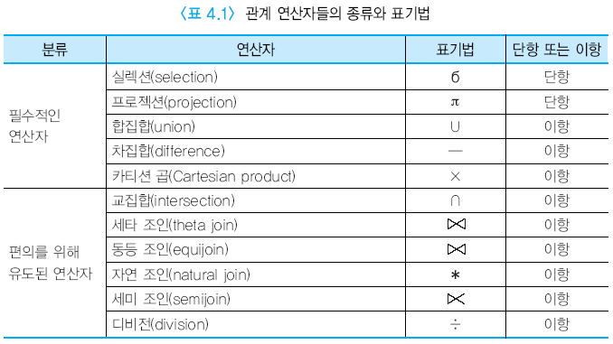

### CS지식

# 프로세스 간 통신
```
프로세스 간 통신 Inter Process Communication : 공유 메모리, 소켓, 세마포어, 메시지큐 등 프로세스간 통신하는 기술
ex) 공유 메모리, 소켓, 세마포어, 메시지큐, 메모리 맵, 파이프, FIFO
```

# 시스템 통합
```
EAI Enterprise Application integration (기업 응용프로그램 통합) : 기업에서 운영되는 서로 다른 플랫폼 및 어플리케이션 간의 정보를 전달, 연계, 통합이 가능하도록 해주는 솔루션

1. 포인트 투 포인트(point to point) : 점 대 점으로 연결하는 방식, 변경 및 재사용 어려움
2. Hub & Spoke : 단일 접점인 허브 시스템을 통해 데이터를 전송하는 중앙 집중형 방식, 확장 및 유지보수는 용이하지만 허브 장애 발생시 시스템 전체에 영향을 미침.
3. Message Bus : 어플리케이션 사이에 미들웨어를 둬 처리하는 방식, 확장성이 뛰어나며 대용량 처리 가능
4. Hybrid : Hub&Spoke와 Message Bus의 혼합 방식, 데이터 병목현상을 최소화 할 수 있다.

```

# 요구사항
```
요구사항의 분류
1. 기능적 요구사항
시스템이 제공하는 기능, 서비스에 대한 요구사항

2. 비기능적 요구사항
시스템이 수행하는 기능 이외의 사항, 시스템 구축에 대한 제약사항에 관한 요구사항

```

# 소프트웨어 테스트의 종류
```
블랙박스 테스트 : 사용자의 입장에서 소프트웨어 혹은 제품에 대한 요구사항과 결과물이 일치하는지 확인하기 위한 테스트.

기법(분석 종류)
 동치 분할 기법 Equivalence partitioning : 입력 데이터의 영역을 유사한 도메인별로 유효값과 무효값을 그룹핑하여 나누어서 검사.

 경계값 분석 기법 Boundary Value Analy : 입력 조건의 경계값을 이용하여 테스트 케이스 생성

 오류 예측 기법 Error Guessing : 각 시험 기법들이 놓치기 쉬운 오류들을 감각, 경험으로 찾는 방법

 원인 결과 그래프 기법 cause Effect Graph : 입력 데이터 간 관계가 출력에 미치는 영향을 그래프로 표현하여 오류를 발견
 
 의사결정 테이블 테스팅 : 논리적 조건이나 상황에서 입력 조건과 결과를 참, 거짓으로  표현하여 조합을 만들고 테스트케이스를 작성

 상태전이 테스팅 : 시스템에 반영되는 이전의 상태가 무엇인지, 상태간 전이, 상태를  변화시키는 이벤트와 입력값을 파악.

화이트박스 테스트 : 개발자의 입장에서 소프트웨어 혹은 제품의 내부 구조, 동작을 테스트 하는 방식

기법(분석 종류)
문장 검증 : 프로그램의 모든 문장이 적어도 한번씩 수행되는 검증 기준
선택 검증 : 선택하는 부분만 검증
경로 검증 : 수행 가능한 모든 경로 검사
조건 검증 : if문이나 while문 내 조건식을 조사하는 검증.

단위 테스트 Unit Test : 모듈테스트라고도 하며, 시스템에서 테스트 가능한 가장 작은 단위를 개별적으로 테스트를 수행한다. 일반적으로 개발되는 제품이나 시스템의 단위 클래스나 함수들을 테스트 대상으로 본다.

통합 테스트 Integration Test : 프로그램 또는 그 구성요시인 모듈 등의 정보 시스템 하나하나의 구성 요소를 결합하여 구성 요소간의 인터페이스와 각 결합 단계에서의 기능을 확인하는 테스트이다.

시스템 테스트 System Test : 구현된 시스템이 정해진 요건에 적합한지 여부를 평가하기 위하여 실제 운용과 같은 환경에서 시스템 전체에 대해서 행하는 테스트를 말한다.

인수 테스트 Acceptance Test : 계약상의 요구 사항이 만족되었는지 확인하기 위해, 설치 후 구매자의 현장에서 납품자도 참가하여 구입자에 의해 실시되는 시스템 또는 기능 단위의 테스트.

회귀 테스트 Regression Test : 어플리케이션에 대하여 변경, 결함 수정 또는 기능개선 등과 같은 원인으로 프로그램 코드에 대하여 물리적인 변경이 발생했을 경우, 새로운 결함에 대비하여 이미 실시했던 테스트케이스에 대하여 전체 또는 일부를 재시험하는 테스트이다.

알파 테스트 Alpha Test : 어플리케이션 개발한 회사내에서 수행하는 테스트.

베타 테스트 Beta Test : 개발자가 아닌 사용자가 수행하는 테스트.

```

# 접근제어
```
임의적 접근 통제 DAC Discretionary Access Control : 시스템 객체의 접근을 개인 또는 그룹의 식별자에 기반을 둔 방법, 어떤 종류의 접근 권한을 가진 사용자가 다른 사용자에 자신의 판단에 따라 권한을 허용하는 접근제어 방식

강제적 접근 통제 MAC Mandatory Access Control : 미리 정해진 정책과 보안 등급에 의거하여 주체에게 허용된 접근 권한과 객체에게 부여된 허용 등급을 비교하여 접근을 통제하는 모델. 소유자라고 할지라도 정책에 어긋나면 객체에 접근 불가.
```

# 결합도 Coupling
```
모듈 간에 상호 의존하는 정도 또는 두 모듈 사이의 연관 관계를 의미.
결합도는 낮을수록 좋다.(모듈의 독립성이 높아짐.)

자료 결합도 Data Coupling: 어떤 모듈이 다른 모듈을 호출하면서 매개 변수나 인수로 데이터를 넘겨주고, 호출 받은 모듈은 받은 데이터에 대한 처리 결과를 다시 돌려주는 방식

스탬프 결합도 Stamp Coupling : 모듈 간의 인터페이스로 배열이나 객체, 구조 등이 전달되는 결합도.

제어 결합도 Control Coupling : 한 모듈이 다른 모듈의 상세한 처리 절차를 알고 있어 이를 통제하는 경우나 처리 기능이 두 모듈에 분리되어 설계된 경우에 발생한다.

외부 결합도 External Coupling : 어떤 모듈에서 선언한 데이터(변수)를 외부의 다른 모듈에서 참조할 때의 결합도.

공통(공유) 결합도 Common coupling : 공유되는 공통 데이터 영역을 여러 모듈이 사용할 때의 결합도

내용 결합도 Content Coupling : 한 모듈이 다른 모듈의 내부 기능 및 그 내부 자료를 직접 참조하거나 수정할 때의 결합도이다.

```

# 응집도 Cohesion
```
모듈의 독립성을 나타내는 개념으로, 모듈 내부 구성요소 간 연관 정도, 정보 은닉 개념의 확장개념으로 하나의 모듈은 하나의 기능을 수행하는 것을 의미.
응집도는 높을수록 좋다. (모듈은 독립성이 높을수록 좋음.)

우연적 응집도 Coincidental Cohesion : 모듈 내부의 각 구성 요소들이 서로 관련 없는 요소로만 구성된 경우의 응집도

논리적 응집도 Logical Cohesion : 유사한 성격을 갖거나 특정 형태로 분류되는 처리 요소들로 하나의 모듈이 형성되는 경우의 응집도

시간적 응집도 Temporal Cohesion : 특정 시간에 처리되는 몇 개의 기능을 모아 하나의 모듈로 작성할 경우의 응집도

절차적 응집도 Procedural Cohesion : 모듈이 다수의 관련 기능을 가질 때 모듈 안의 구성 요소들이 그 기능을 순차적으로 수행할 경우의 응집도

교환적 응집도 Communication Cohesion : 동일한 입력과 출력을 사용하여 서로 다른 기능을 수행하는 구성 요소들이 모였을 경우의 응집도

순차적 응집도 Sequential Cohesion : 모듈 내 하나의 활동으로부터 나온 출력 데이터를 그다음 활동의 입력 데이터로 사용할 경우의 응집도

기능적 응집도 Functional Cohesion : 모듈 내부의 모든 기능 요소들이 단일 문제와 연관되어 수행될 경우의 응집도

```

# UX, UI
```
UX User Experience : 사람의 감정이나 경험을 나타내는 개념

UI User Interface : 사용자 인터페이스
ex) cli, gui, nui
```

# 럼바우 분석 기법
```
Rumbaugh : 소프트웨어 구성 요소를 그래픽 표기법을 이용하여 모델링. 객체 모델링 기법(OMT, Object Modeling Technique) 이라고도 함. 분석 활동은 객체 모델링, 동적 모델링, 기능 모델링을 통해 이루어짐.

객체 모델링 Object Modeling : 정보 모델링(Information Modeling)이라고도 하며, 시스템의 정적 구조 표현. 시스템에서 요구되는 객체를 찾아내어 속성과 연산 식별, 객체들 간의 관계를 규정하고 객체 다이어그램으로 표시
=> 구조

동적 모델링 Dynamic Modeling : 상태 다이어그램(상태도 DFD)을 이용하여 시간의 흐름에 따라 객체들 간의 제어 흐름, 상호 작용, 동작 순서 등의 동적인 행위 표현. 
=> 시간에 따라 변하는 것

기능 모델링 Functional Modeling : 데이터 값의 변화 과정 표현, 자료 흐름도(DFD)를 이용하여 다수의 프로세스들 간의 자료 흐름을 중심으로 처리 과정을 표현.
=> 입력값이 출력값일 떄
```

# 객체지향
```
추상화 관계
연관화 Association (is-member-of): 공통된 의미를 서로 연관된 집단으로 표현하는 방법으로 링크와 그 의미가 유사. 객체들의 물리적 또는 개념적 연결을 두 개 이상의 객체와 클래스로 표현

분류화 Classification (is-instance-of) : 공통된 속성에 의하여 정의된 객체 및 클래스에 있어 구성원들의 인스턴스, 분류화는 동일한 형의 특성을 갖는 객체들이 모여 클래스를 구성하는 것.

집단화 Aggregation (is-part-of) : 서로 관련 있는 여러 개의 객체를 묶어 한 개의 상위 객체 생성, 클래스들 사이의 전체 또는 부분 같은 관계를 나타내는 것

일반화 Generalization (is-A) : 객체들에 있어 공통적인 성질들을 상위 객체로 정의

특수화 Specialization (is-A) : 일반화와 개념은 같으나, 클래스를 보는 시점에 있어 상위의 클래스에서 하위의 클래스를 보는 관점.
=> 특수화는 하위 클래스로 정의하는것 일반화의 역이라고 생각하면 편함.
```

# 객체지향 - 디자인 패턴
```
생성 패턴 Creational Pattern : 객체 생성에 관련된 패턴, 객체의 생성과 조합을 캡슐화해 특정 객체가 생성되거나 변경되어도 프로그램 구조에 영향을 크게 받지 않도록 유연성을 제공한다.
ex) abstract Factory, 빌더, 팩토리 메소드, 프로토타입, 싱글톤

구조 패턴 Structural Pattern : 클래스나 객체를 조합해 더 큰 구조를 만드는 패턴, 예를 들어 서로 다른 인터페이스를 지닌 2개의 객체를 묶어 단일 인터페이스를 제공하거나 객체들을 서로 묶어 새로운 기능을 제공하는 패턴이다.
ex) 어댑터, 브릿지, 컴퍼지트, 데커레이터, 퍼사드, 플라이웨이트, 프록시

행위 패턴 Behavioral Pattern : 객체나 클래스 사이의 알고리즘이나 책임 분배에 관련된 패턴, 한 객체가 혼자 수행할 수 없는 작업을 여러개의 객체로 어떻게 분배하는지, 또 그렇게 하면서도 객체 사이의 결합도를 최소화하는 것에 중점을 둔다.
ex) 책임 연쇄, 커맨드, 인터프리터, 이터레이터, 미디에이터, 메멘토, 옵저버, 테이트, 스트레이티지, 템플릿 메서드, visitor
```

# 객체지향 - 객체지향 설계원리 SOLID
```
SOLID : 개발자가 보다 유지 관리 가능하고 확장 가능하며 유연한 소프트웨어를 설계하는 데 도움이 되는 5가지 객체 지향 설계 원칙의 약어이다. 이러한 원칙은 개발자가 시간이 지남에 따라 더 쉽게 이해하고 유지 관리하고 수정할 수 있는 소프트웨어를 만드는 데 도움을 주기 위한 것입니다.

SRP Single Responsibility Principle : 클래스는 변경할 이유가 하나만 있어야 합니다. 즉, 클래스는 하나의 책임이나 할 일만 가져야 합니다.

OCP Open Close Principle : 수정에 대해서는 닫혀있고, 확장에는 열려 있어야 한다.
즉, 기존 코드를 수정하지 않고도 새로운 기능이나 동작을 클래스에 추가할 수 있어야 합니다.

LSP Liskov Substitution Principle : 하위 타입은 상위 타입을 대체할 수 있어야 한다. 
ex) q(x)를 자료형 T의 객체 x에 대해 증명할 수 있는 속성이라 하자. 그렇다면 S가 T의 하위형이라면 q(y)는 자료형 S의 객체 y에 대해 증명할 수 있어야 한다.

ISP Interface Segregation Principle : 클라이언트가 자신이 이용하지 않는 메소드에 의존하지 않아야 한다는 원칙, 큰 덩어리의 인터페이스들을 구체적이고 작은 단위들로 분리시킴으로써 클라이언트들이 꼭 필요한 메서드들만 이용할 수 있게 한다.
또는 
클라이언트가 사용하지 않는 메서드에 의존하도록 강요해서는 안 됩니다. 이는 일부 클라이언트가 필요로 하지 않는 메서드를 포함하는 하나의 큰 인터페이스를 만드는 대신 인터페이스를 사용하는 클라이언트의 요구 사항에 맞는 인터페이스를 디자인해야 함을 의미합니다.

DIP Dependency Inversion Principle : 고수준 모듈은 저수준 모듈에 의존해서는 안 됩니다. 대신 둘 다 추상화에 의존해야 합니다. 즉, 다른 모듈이나 클래스에 의존하는 모듈이나 클래스가 구체적인 구현이 아닌 추상화나 인터페이스에 의존하도록 소프트웨어를 설계해야 합니다.

```

# OSI 7계층
```
1계층 물리 계층 Physical : 주로 전기적, 기계적, 기능적인 특성을 이용해서 통신 케이블로 데이터를 전송하는 물리적인 장비
통신 단위 : Bit
장비 : 통신 케이블, 리피터, 허브 등

2계층 데이터링크 계층 DataLink : 물리계층을 통해 송수신되는 정보의 오류와 흐름을 관리하여 안전한 통신의 흐름을 관리.
전송 단위 : 프레임 Frame
장비 : 브리지, 스위치, 이더넷 등(여기서 MAC 주소를 사용)

3계층 네트워크 계층 Network : 데이터를 목적지까지 가장 안전하고 빠르게 전달.
전송 단위 : 패킷 Packet
장비 : 라우터

4계층 전송 계층 Transport : port번호, 전송방식(TCP/UDP) 결정, 두 지점간의 데이터를 주고 받게 해주는 역할
TCP : 신뢰성, 연결지향적
UDP : 비신뢰성, 비연결성, 실시간

5계층 세션 계층 Session : 주 지점간의 프로세스 및 통신하는 호스트 간의 연결 유지,
TCP/IP 세션 체결, 포트번호를 기반으로 통신 세션 구성
ex) API, Socket

6게층 표현 계층 Presentation : 전송하는 데이터의 표현방식을 결정(데이터 변환,압축,암호화), 수신자에서 데이터의 압축을 풀 수 있는 방식으로 된 데이터 압축.
ex) JPEG,MPEG,GIF,ASCII 등

7계층 응용 계층 Application : 최종 목적지로 응용 프로세스와 직접 관계하여 일반적인 응용 서비스를 수행 
HTTP, FTP, SMTP,POP3,IMAP, Telent 등과 같은 프로토콜이 있음.
ex) explorer,chrome
```

# UML Diagram 
```
UML Undefined Modeling Langauge : 소프트웨어 시스템을 개발하는 과정에서 산출물의 명세화, 시각화, 문서화할 때 사용하는 모델링 언어로써 하나의 시스템을 표현하기 위한 표준적인 방법을 제공하기 위해서 만들어짐.

UML Diagram의 종류 : 구조 다이어그램, 행위 다이어그램

구조 다이어그램 :
Class Diagram : 클래스의 속성, 함수(method), 변수타입들로 구성된 다이어그램

Object Diagram : 클래스의 인스턴스, 값이 매겨진 행동을 가지고 있는 독립된 객체정보를 표현하는 다이어그램

Package Diagram : UML의 다양한 모델요소를 그룹화한 다이어그램

컴포넌트 Component Diagram : 컴포넌트끼리의 구조 관계를 표현한 다이어그램

배치 Deployment Diagram : 소프트웨어, 하드웨어 등을 포함한 시스템의 물리적인 구조를 나타내는 다이어그램

행위 다이어그램 :
Use Case Diagram : 사용자 관점에서 바라본 시스템을 표현한 다이어그램

Activity Diagram : 여러 활동들이 순차, 병행 방식 등을 수행하는 상황을 표현한 다이어그램. 시스템 내부에 존재하는 여러가지 행위들과 각 행위의 분기, 분기가 생기기 위한 이벤트들을 포함한다. 활동 다이어그램은 시스템 전체의 흐름을 표기하고 상태 다이어그램은 하나의 객체의 흐름을 나타냄.

State Diagram : 하나의 객체가 다른 객체와의 상호 작용에 따라 어떻게 변화하는지 표현하는 다이어그램.

Sequence Diagram : 여러 대상 간의 상호작용을 시간 순서에 따라 표현한 다이어그램.

Communication Diagram : 동작에 참여하는 객체들이 주고받는 메시지를 표현하고, 메시지 뿐만 아니라 객체 간의 관계까지 표현하는 다이어그램.

```

# 파일구조 File Structures
```
파일을 구성하는 레코드들이 보조기억장치에 편성되는 방식으로 접근 방식에 따라 방식이 달라진다.

편성 방법 : 순차 접근, 인덱스 접근(색인 순차), 해싱(직접) 접근.

순차 접근 : 순차 접근은 레코드를 논리적인 처리 순서에 따라 연속된 물리적 저장공간에 기록하는 것을 의미한다. 파일의 레코드들이 순차적으로 기록되어 판독할 때도 순차적으로 접근하기 때문에 순차 접근 방식 이라고도 한다.

장점
파일의 구성이 용이하고, 순차적으로 읽을 수 있으므로 기억공간의 이용 효율이 높다.
레코드만 저장하고 부가적인 정보는 저장하지 않으므로 기억공간의 낭비를 방지할 수 있다.
물리적으로 연속된 공간에 저장되므로 접근 속도가 빠르다.

단점

파일에 새로운 레코드를 삽입하거나 삭제하는 경우 파일 전체를 복사한 후 수행해야 하므로 시간이 많이 걸린다.
파일의 특정 레코드를 검색하려면 순차적으로 모든 파일을 비교하면서 검색해야 하므로 검색 효율이 낮다.

해싱 접근 : 해싱 접근은 파일을 구성하는 레코드를 임의의 물리적 저장공간에 기록하는 것으로, 직접 접근 방식이라고도 한다. 레코드에 특정 기준으로 키가 할당되며, 해싱 함수를 이용하여 키에 대한 보조기억장치의 물리적 상대 레코드 주소를 계산한 후 해당하는 주소에 레코드를 저장한다.

장점

직접 접근 기억장치(DASD)의 물리적 주소를 통하여 파일의 각 레코드에 직접 접근하거나 기록할 수 있으며, 접근 및 기록의 순서에는 제약이 없다.
접근 시간이 빠르고 레코드의 삽입, 삭제, 갱신이 용이하다.

단점

레코드의 주소 변환 과정이 필요하며, 이 과정으로 인해 시간이 소요된다.
기억공간의 효율이 저하될 수 있다.

인덱스 접근 : 인덱스 접근은 순차 접근과 해싱 접근에서 지원하는 편성 방법이 결합된 형태이다. 인덱스를 이용한 순차적인 접근 방법을 제공하여 색인 순차 접근 방식이라고도 한다. 각 레코드를 키 값 순으로 논리적으로 저장하고, 시스템은 각 레코드의 실제 주소가 저장된 색인을 관리한다.

장점

순차 처리와 임의 처리가 모두 가능하다.
효율적인 검색이 가능하고 삭제, 삽입, 갱신이 용이하다.

단점

색인 영역이나 오버플로 영역을 설정해야 하므로 기억공간이 필요하다.
인덱스를 이용하여 참조하기 때문에 접근 시간이 해싱 접근보다 느리다.
```

# RAID
```
2개 이상의 하드디스크로 디스크 배열 구성, 데이터 블록을 서로 다른 디스크에 분산 저장하거나 다중화 함.

단계 0 ~ 6단계
RAID 0 : 스트라이핑, 디스크를 병렬로 연결하며 하나의 디스크만 손상되어도 전체 디스크가 파손됨.

RAID 1 : 미러링, 같은 데이터를 다른 디스크에 동일하게 복사함.

RAID 2 ~ 4: 하나의 디스크에 오류 정정 부호를 각각 비트/바이트/워드 단위로 저장한다. 하나의 디스크가 손상되어도 정상 가동 가능하고 최소 3개의 디스크가 필요함.

RAID 5 : 오류 정정 부호를 여러 디스크에 분산 저장. 마찬가지로 최소 3개의 디스크가 필요하고 하나의 디스크가 손상되어도 정상 동작 가능.

RAID 6 : 오류 정정 부호 2개를 여러 디스크에 분산하여 저장. 2개의 디스크가 손상되어도 정상 가동 가능하고 최소 4개의 디스크가 필요하다.

```

# CS 용어 정리
```
애드혹 네트워크 Ad-hoc Network : 네트워크 장치를 필요로 하지 않고 네트워크 토폴로지가 동적으로 변화되는 특징이 있으며 응용 분야로는 긴급 구조, 긴급 회의, 전쟁터에서의 군사 네트워크에 활용되는 네트워크

AAA : 
Authentication : 시스템을 접근하기 전에 접근 시도하는 사용자의 신원을 검증
Authorization : 검증된 사용자에게 어떤 수준의 권한을 허용
Accounting : 사용자의 자원(시간,정보,위치 등)에 대한 사용 정보를 수집

스푸핑 Spoofing : 속이다 라는 뜻으로 속임을 이용한 공격이라 총칭함
ARP Spoofing : MAC 주소를 속임, 근거리 통신망에서 데이터 패킷을 중간에서 가로채는 중간자 공격 기법으로 데이터링크상의 프로토콜인 ARP를 이용하기때문에 근거리 통신에서만 사용 가능하다.

IP Spoofing : IP 주소를 속임

DNS Spoofing : DNS 주소를 속임, 정상적인 접속에서는 사용자가 접속하고자 하는 사이트에 대한 IP주소를 DNS서버에서 받아와야 하지만 공격자가 DNS 서버를 장악하거나 공격자가 설정한 임의의 IP주소를 사용자에게 보내 원하는 사이트로 이동시키는 것.

JUnit : 자바 프로그래밍언어를 이용한 xUnit의 테스트 기법으로써 숨겨진 단위테스트를 끌어내어 정형화시켜 단위 테스트를 쉽게 해주는 테스트용 프레임워크이다.
```

# 소스코드 품질분석 도구
```
소스 코드의 코딩 스타일, 코드에 설정된 코딩 표준, 코드의 복잡도, 코드에 존재하는 메모리 누수 현상, 스레드 결함 등을 발견하기 위해 사용하는 분석 도구로, 정적 분석도구와 동적 분석도구로 구분한다.

정적 분석 도구 : 소스 코드의 실행 없이, 코드의 의미를 분석해 결함을 찾아내는 원시적 코드 분석 기법

동적 분석 도구 : 소스 코드를 실행하여 프로그램 동작이나 반응을 추적하고 코드에 존재하는 메모리 누수, 스레드 결함 등을 분석하는 기법
```

# V 다이어그램
```
V&V 및 테스팅에 대한 절차를 V자 형태로 표현한 다이어그램
```


# 관계 해석 && 관계 대수
```
관계 해석 :  관계 데이터 모델의 제안자인 코드(E. F. Codd)가 수학의 Predicate Calculus(술어 해석)에 기반을 두고 관계 데이터베이스를 위해 제안했다.
관계해석은 관계 데이터의 연산을 표현하는 방법으로, 원하는 정보를 정의할 때 계산 수식을 사용한다.
관계해석은 원하는 정보가 무엇이라는 것만 정의하는 비절차적 특성을 지닌다.
튜플 관계해석과 도메인 관계해석이 있다.
기본적으로 관계해석과 관계대수는 관계 데이터베이스를 처리하는 기능과 능력 면에서 동등하며, 관계대수로표현하는 식은 관계해석으로 표현할 수 있다.

관계 대수 : 릴레이션을 처리하기 위한 연산의 집합으로서 각 연산의 피 연산자가 모두 릴레이션이고, 연산 결과도 릴레이션이라는 특징을 가지고 있다.
```


# 형상 관리 SCM
```
SCM Software Configuration Management : 소프트웨어 개발 프로세스 각 단게에서 소프트웨어 변경 점을 체계적으로 추적하고 관리하는 일렬의 활동이다.
단지 소스 코드의 버전 관리만을 의미하는 것이 아니라 소프트웨어의 생명 주기 동안의 요구 사항, 설계 문서, 소스 코드, UI 문서, Test Case 및 각종 결과물에 대해서 형상을 만들고, 형상들의 관계 및 변경 사항, 변경 시점 등을 체계적으로 관리하는 것으로 소프트웨어 개발에서 필수 활동 중 하나입니다.
ex) CVS, Git, SVN

CVS Concurrent Version System : 1990년에 출시되었으며, OSS Open Source System 로 서버와 클라이언트로 구분되어, 개발과정에서 사용하는 파일들의 변경 명세를 관리하기 위한 시스템 입니다.

특징
오랜 기간 많은 유저가 사용하였고, 시스템이 안정적이다.
중앙에 위치한 Repository에 파일을 저장하고, 모든 사용자가 파일을 접근할 수 있도록 설계(서버는 Unix 종류 시스템에서 구동, client Software는 다양한 운영체제에서 가능)
checkout으로 파일을 복사하고, Commit을 통해 변경 사항을 저장.
파일의 히스토리를 보존하기 때문에 과거 이력을 확인할 수 있음.
Commit 중 오류가 발생하면 롤백되지 않음.
다른 개발자가 작업 중인 파일에 덮어쓰기가 방자.
Repository를 백업하는 것만으로 프로젝트의 백업이 될 수 있음.
상대적으로 속도가 느림.

SVN Subversion : CVS의 단점을 보완하기 위해 2000년에 만들어 졌으며, OSS(Apache)로 서버와 클라이언트로 구분되어, 개발과정에서 사용하는 파일들을 관리하기 위한 시스템 입니다.

특징
최초 1회에 한해 파일 원본을 저장하고 이후에는 실제 파일이 아닌 원본과 차이점을 저장하는 방식.
언제든지 원하는 시점으로 복구가 가능함.
Trunk, Branches, Tags의 폴더로 구성하여 형상 관리함.
import, commit, commit log, checkout, revert, switch, update, merge 등의 명령어 사용.

Git : 2005년 리누스 토르발스가 리눅스 커널의 개발을 위해 만들었으며, OSS(GPL2)로 개발자가 중앙 서버에 접속하지 않은 상태에서도 코딩 작업을 할 수 있도록 지원하는 버전 관리 시스템 입니다.

특징
Branching 모델, 로컬에 다수의 독립성이 보장되는 branch를 허용하고 쉽게 생성, 병합, 삭제를 지원함.
원격 서버 Git Repository에 push 하지 않은 채 여러 branch 생성이 가능함.
로컬 우선 작업을 통해 성능이 SVN, CVS 보다 우수함.
팀 개발을 위한 분산 환경 코딩에 최적화
파일 암호화 및 체크섬 CheckSum을 통한 데이터 보장.
Staging Area를 통해 서버의 Repository로 업로드함.
원격 Repository 장애에도 문제없이 버전 관리 가능함.
```

# 스케줄링 Scheduling
```
일련의 작업을 효율적이고 효과적인 방식으로 완료하기 위해 사람, 장비 또는 시간과 같은 리소스를 할당하는 프로세스. 프로젝트 관리의 맥락에서 스케줄링에는 프로젝트를 완료하는 데 필요한 일련의 활동, 각 활동의 기간 및 이를 완료하는 데 필요한 리소스를 설명하는 계획 작성이 포함

방식
Gantt 차트: 각 작업의 시작 날짜와 종료 날짜 및 작업 간의 종속성을 보여주는 프로젝트 일정의 시각적 표현입니다.

중요 경로 방법(CPM): 프로젝트를 일정대로 완료하기 위해 정시에 완료해야 하는 주요 경로 또는 활동 시퀀스를 식별하는 일정 기술입니다.

프로그램 평가 및 검토 기법(PERT): 프로젝트의 예상 기간을 계산하기 위해 각 활동(낙관적, 가능성이 가장 높음, 비관적)에 대해 세 가지 시간 추정치를 사용하는 기법입니다.

민첩한 스케줄링: 프로젝트를 더 작은 작업으로 나누고 짧은 스프린트 또는 반복으로 완료하는 것과 관련된 스케줄링에 대한 반복적이고 유연한 접근 방식입니다.

알고리즘

선점형 스케줄링 : 우선순위가 더 높은 태스크에 의해 태스크가 중단되고 CPU 외부로 이동될 수 있는 스케줄링 기술로 우선순위가 더 높은 작업이 도착하면 실행 중인 작업에서 CPU를 빼앗아 우선 순위가 더 높은 작업에 대신 CPU를 할당할 수 있습니다.

라운드 로빈(RR) 스케줄링: 각 작업이 중단되어 대기열의 맨 뒤로 이동하기 전에 고정된 시간 조각(예: 10ms) 동안 실행되는 선제적 스케줄링 알고리즘입니다. RR은 모든 작업이 공정하게 CPU 시간을 받도록 보장할 수 있지만 컨텍스트 전환으로 인해 오버헤드가 증가할 수 있습니다.

SRT Shortest Remaining Time scheduling 스케줄링 : 최단 잔여시간을 우선으로 하는 스케줄링, 진행 중인 프로세스가 있어도, 최단 잔여시간인 프로세스를 위해 sleep 시키고 짧은 프로세스를 먼저 할당한다.

MLQ Multi Level Queue 스케줄링 : 우선순위마다 준비 큐 형성하고 항상 가장 높은 우선순위 큐의 프로세스에 CPU를 할당. 각 큐는 라운드 로빈이나 FCFS등 독자적 스케줄링에 사용 가능. 우선순위가 낮은 프로세스가 오랫동안 CPU 할당에 기다리는 기아 현상이 발생할 수 있다.

비선점형 스케줄링 :  태스크가 완료되거나 차단될 때까지 실행되도록 허용되는 스케줄링 기술로 작업은 자발적으로 CPU를 해제하거나 차단된 경우에만 제거된다.

FCFS(First-Come, First-Served) 스케줄링: 작업이 도착한 순서대로 실행되는 비선점형 스케줄링 알고리즘입니다. FCFS는 구현이 간단하지만 실행 시간이 더 긴 작업의 대기 시간이 길어질 수 있습니다.

최단 작업 우선 SJF(Shortest Job First) 스케줄링: 예상 실행 시간이 가장 짧은 작업을 먼저 실행하는 비선점형 스케줄링 알고리즘입니다. SJF는 대기 시간을 최소화하고 시스템 처리량을 향상시킬 수 있지만 정확한 실행 시간 추정이 필요합니다.

HRN Highest Response ratio Next : 짧은 작업에 유리한 SJF의 단점을 개선 한 기법, 각 작업의 우선순위로 서비스 해주는 스케줄링.
우선순위 계산 : (대기시간+서비스시간)/서비스시간
```

# 보안 관련
```
임시 키 무결성 프로토콜 TKIP  Temporal Key Integrity Protocol : IEEE 802.11 무선 네트워킹 표준에 사용되는 보안 프로토콜, IEEE 802.11i의 작업 그룹과 WiFi 얼라이언스에서 WEP를 하드웨어 교체 없이 대체하기 위해 고안.

ISMS Information Security Management System : 정부에서 정한 인증기관 및 심사기관에서 기업이 주요 정보자산을 보호하기 위해 수립, 관리, 운영하는 정보보호 관리체계가 인증 기준에 적합한지를 심사하여 인증을 부여하는 제도.

워터링 홀 Watering Hole : 이 공격은 APT 공격에서 주로 쓰이는 공격으로, 공격 대상이 방문할 가능성이 있는 합법적인 웹 사이트를 미리 감염시킨 뒤, 잠복하고 있다가 공격 대상이 방문하면 대상의 컴퓨터에 악성코드를 설치하는 방식이다.

SSO Single Sign On : 여러 개의 사이트에서 한번의 로그인으로 여러가지 다른 사이트들을 자동적으로 접속하여 이용하는 방법을 말한다. 일반적으로 서로 다른 시스템 및 사이트에서 각각의 사용자 정보를 관리하게 되는데 이때 하나의 사용자 정보를 기반으로 여러 시스템을 하나의 통합 인증을 사용하게 하는 것을 말한다. 즉 하나의 시스템에서 인증을 할 경우 타 시스템에서는 인증 정보가 있는지 확인하고 있으면 로그인 처리를 하도록 하고, 없는 경우 다시 통합 인증을 할 수 있도록 만드는 것을 의미한다.

사회공학 social Engineering : 보안학적 측면에서 기술적인 방법이 아닌 사람들 간의 기본적인 신뢰를 기반으로 사람을 속여 비밀 정보를 획득하는 기법

다크 데이터 Dark Data : 빅테이터와 비슷하면서도 구조화 되어 있지 않고, 더는 사용하지 않는 '죽은' 데이터를 의미한다. 일반적으로 정보를 수집해 저장한 이후 분석이나 특별한 목적을 위해 활용하는 데이터가 아니며, 저장공간만 차지하고 이러한 이유로 심각한 보안 위험을 초래할 수 있다.

SIEM Security Information Event Management : SIM + SEM을 결합한 것으로, 머신러닝 기술을 이용하여 IT 시스템에서 발생하는 대량의 로그를 통합관리 및 분석하여 사전에 위협에 대응하는 보안 솔루션이다. 서로 다른 기종의 보안솔루션 로그 및 이벤트를 중앙에서 통합 수집하여 분석할 수 있으며, 네트워크 상태의 monitoring 및 이상징후를 미리 감지할 수 있다.

TrustZone : 프로세서 안에 독립적인 보안 구역을 따로 두어 중요한 정보를 보호하는 ARM사에서 개발한 하드웨어 기반의 보안 기술로 프로세서 안에 독립적인 보안 구역을 별도로 하여, 중요한 정보를 보호하는 하드웨어 기반의 보안 기술이다.

Typosquatting : 사용자들이 사이트에 접속할 때 주소를 잘못 입력하거나 철자를 빠뜨리는 실수를 이용하기 위해 유사한 유명 도메인을 미리 등록하는 일로 URL 하이재킹이라고도 함.
사회공학적 기법 중 하나이다.

참고 URL
https://94kimseongjun.tistory.com/144
```